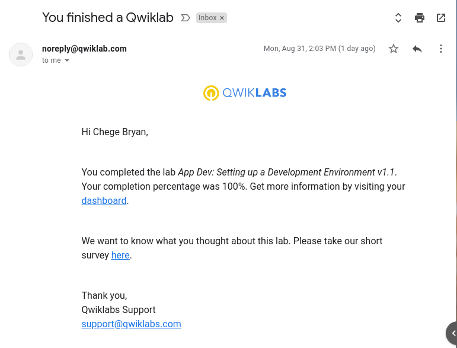
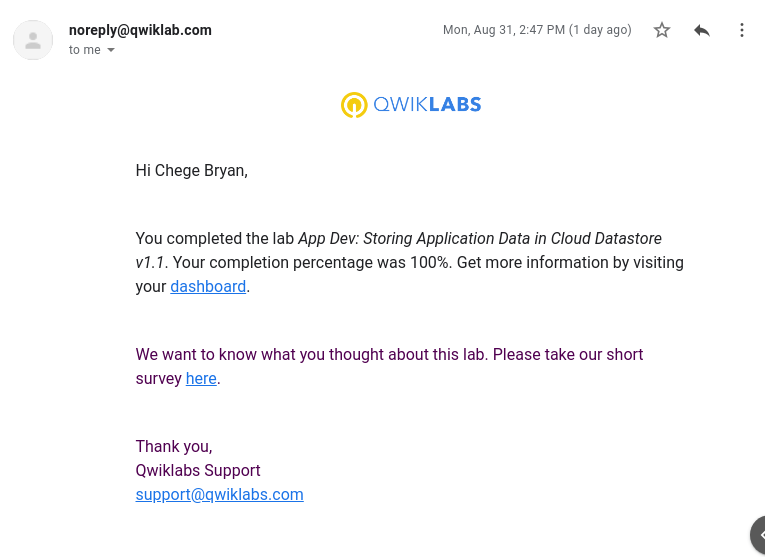
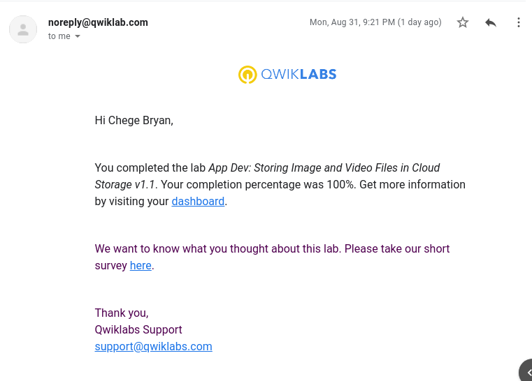
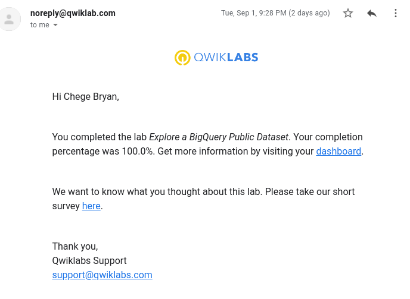
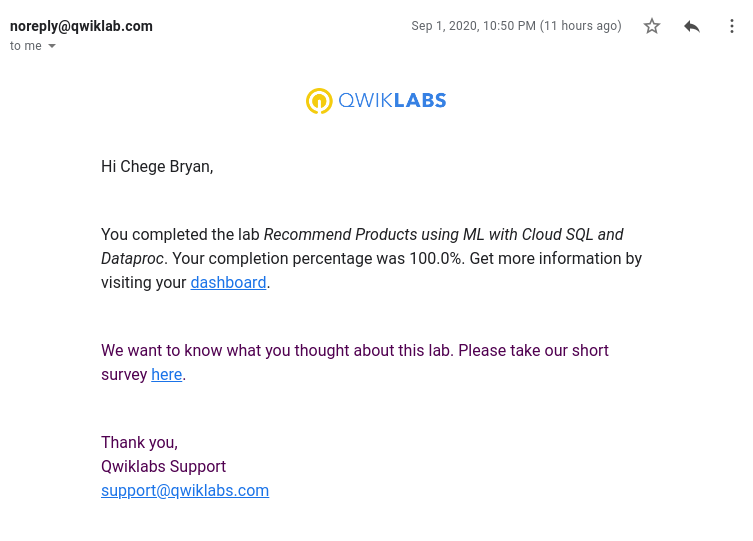
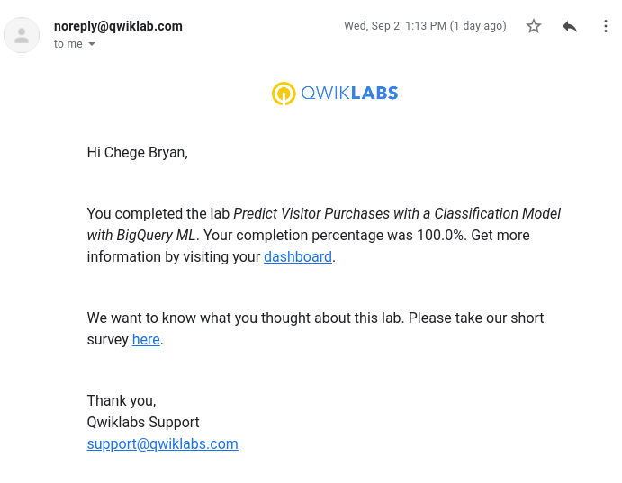
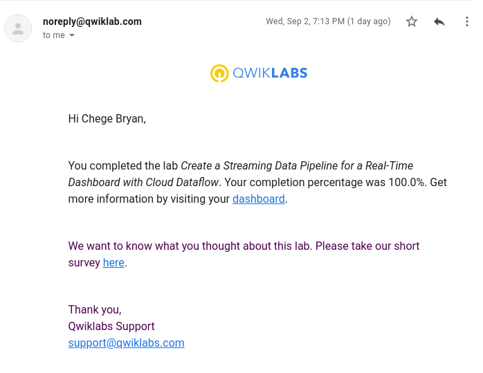
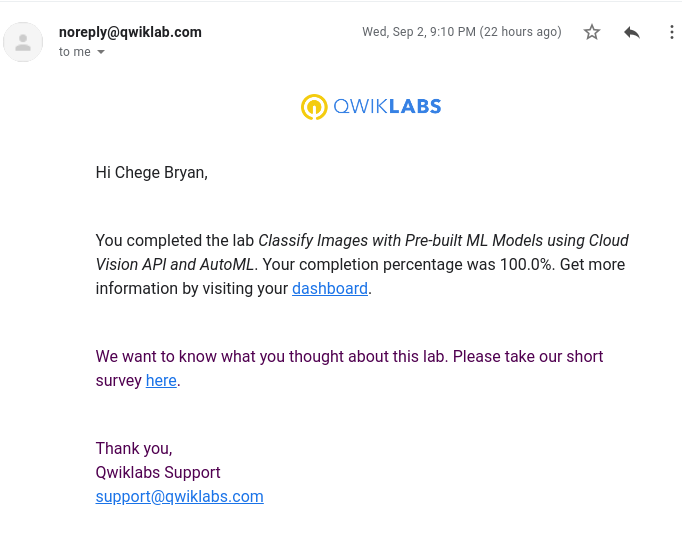
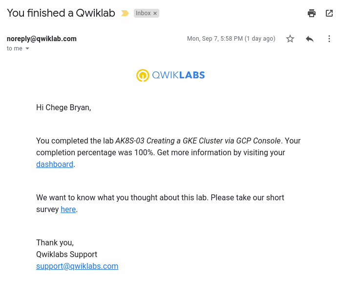

# gads-2020-cloud-project-1

Documents my Completion for GADS2020 Phase 2 Project

## Qwiklabs Completed

  
App Dev: Setting up a Development Environment v1.1

  

  
App Dev: Storing Application Data in Cloud Datastore v1.1

  

  
App Dev: Storing Image and Video Files in Cloud Storage v1.1

  

  
Explore a BigQuery Public Dataset

  

  
Recommend Products using ML with Cloud SQL and Dataproc

  

  
Predict Visitor Purchases with a Classification Model with BigQuery ML

  

  
Create a Streaming Data Pipeline for a Real-Time Dashboard with Cloud Dataflow

  

  
Classify Images with Pre-built ML Models using Cloud Vision API and AutoML

  

  
AK8S-03 Creating a GKE Cluster via GCP Console

  

## Translation Code

[Google Cloud Fundamentals: Getting Started with Compute Engine](translation1.md)

[Google Cloud Fundamentals: Getting Started with Cloud Storage and Cloud SQL](translation2.md)
